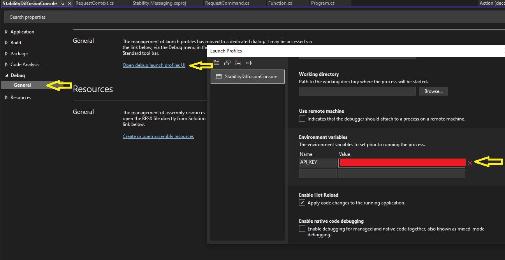

# Dot Net 6 Client for Stability Diffusion GRPC

This is a .Net 6 client for the Stability Diffusion GRPC API, pointed to Stability.ai's endpoint at grpc.stability.ai:443.

For more information on the API, visit the official SDK:

https://github.com/Stability-AI/stability-sdk

https://github.com/Stability-AI/api-interfaces

## Requirements

* Net 6 SDK (https://dotnet.microsoft.com/en-us/download/dotnet/6.0)
* An IDE is strongly suggested. Visual Studio 2022, Rider, VS Code, etc.
* Future: AWS Toolkit for VS 2022 https://marketplace.visualstudio.com/items?itemName=AmazonWebServices.AWSToolkitforVisualStudio2022

## Features

* Reusable client that can be used via a variety entry points (CLI, API, queue consumer, etc.)
* A simple command line interface, similar to existing Python scripts, that calls the client

### Command line

Set an evironment variable for API_KEY, which you can get from your DreamStudio profile.  *Calls cost credits.*  Note: you can use small sizes and steps to reduce credit use for debugging, ex. 384x384 5 steps

    dotnet run --project Cli\Txt2Img\Txt2ImgCli.csproj --prompt "a golden cat on a table"

    dotnet run --project Cli\Txt2Img\Txt2ImgCli.csproj --prompt "a boy and his dog" --h 384 --w 384 --n_samples 5 --engine "stable-diffusion-v1-5" --steps 40

Img2img works similarly, with an init-image

    dotnet run --project Cli\Img2Img\ImgImgCli.csproj --prompt "a boy and his cat" --init-image 00000.png --strength 0.75 

...or compile and run the EXE, setting your API_KEY via your environment

    Txt2Img -h 384 -w 384 -prompt "a golden cat on a table"

For debuggin in VS2022, set the "API_KEY" environment variable to your Dreamstudio API key debug config.  Right click Txt2Img or Img2Img project, Properties, and set it here:

The launchsetting.json that writes this to disk in plaintext has been excluded in .gitignore, but take care.  I suggest using different accounts for production with tighter controls on your api key and setting environment variables via your actual environment.  The launchsettings can also be used to supply default commadline settings, such as --init-image for easier debugging.

Example commandline output:

    9/17/2022 8:26:56 PM: **** Generated Txt2Img Request id: 5ec2a128-2db7-4e4d-81cf-d04d568fcf5f ****
    * sampler: SamplerDdpm, steps: 30, samples: 1, model: stable-diffusion-v1-5
    * H: 512, W: 512, prompt: a golden cat on a table
    9/17/2022 8:26:59 PM: Keepalive received
    9/17/2022 8:26:59 PM: Received Answer, request id: 5ec2a128-2db7-4e4d-81cf-d04d568fcf5f:0
    9/17/2022 8:26:59 PM: Received Answer, request id: 5ec2a128-2db7-4e4d-81cf-d04d568fcf5f:0
    9/17/2022 8:26:59 PM: Received image. Seed: 2468920275
    9/17/2022 8:26:59 PM: Writing: output/00000.png
    Elapsed total request 5ec2a128-2db7-4e4d-81cf-d04d568fcf5f process time: 3.68 s

Img3Img:

    9/17/2022 9:11:55 PM: ****  Generated Img2Img Request id: 02218fd4-738d-407c-b661-07b62a52892d ****
    * sampler: SamplerDdpm, steps: 30, samples: 1, model: stable-diffusion-v1-5, initImg: output\00000.png, , str: 0.4
    * H: 512, W: 512, prompt: a boy and his cat
    9/17/2022 9:12:01 PM: Keepalive received
    9/17/2022 9:12:01 PM: Received Answer, request id: 02218fd4-738d-407c-b661-07b62a52892d:0
    9/17/2022 9:12:01 PM: Received Answer, request id: 02218fd4-738d-407c-b661-07b62a52892d:0
    9/17/2022 9:12:01 PM: Received image. Seed: 3184576731
    9/17/2022 9:12:01 PM: Writing: output/00003.png
    Elapsed total request 02218fd4-738d-407c-b661-07b62a52892d process time: 6.59 s

To see all parameters supported, run:

    dotnet run --project Cli\Txt2Img\Txt2ImgCli.csproj -- --help

Result:

        Description:
    command line args

    Usage:
    Txt2ImgCli [options]

    Options:
    -h <h>                            Height of the image to be created in pixels. [default: 512]
    -w <w>                            Width of the image to be created in pixels. [default: 512]
    -ddim_steps, -steps <ddim_steps>  Steps [default: 30]
    -prompt <prompt>                  Text prompt. []
    -engine <engine>                  engine [default: stable-diffusion-v1-5]
    -outdir <outdir>                  Output directory [default: output/]
    -sampler <sampler>                Sampler option: [ddim, plms, k_euler, k_euler_acenstral, k_dpm_2, klms, k_heun] []
    -n_iter, -n_samples <n_samples>   Number of images to create [default: 1]
    --version                         Show version information
    -?, -h, --help                    Show help and usage information

## Near term

* Alternate console command that uses a config file for params (limited to 9 args with System.Commandline)
* Complete common parameters

## Possible Future Updates

* AWS Lambda SQS/S3 project to call the client and save images to S3. 
* GRPC service side for self hosting
* React UI
* tinygrad backend for inference?